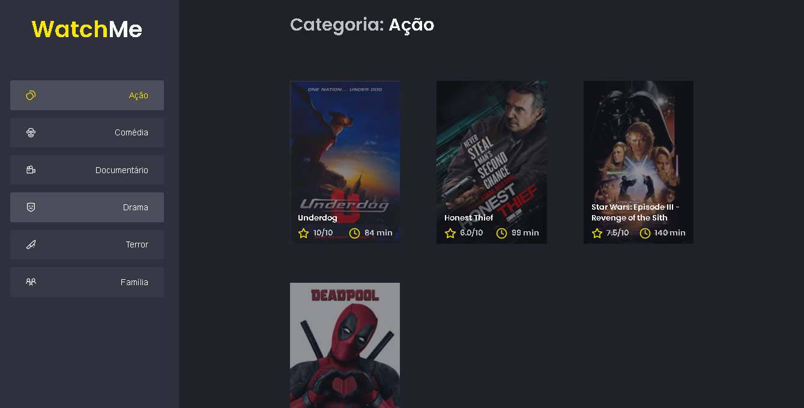

<h1 align="center">
    
</h1>

<p align="center">
  <a href="#-technologies">Technologies</a>&nbsp;&nbsp;&nbsp;|&nbsp;&nbsp;&nbsp;
  <a href="#-layout">Getting started</a>&nbsp;&nbsp;&nbsp;|&nbsp;&nbsp;&nbsp;
  <a href="#-project">Project</a>&nbsp;&nbsp;&nbsp;|&nbsp;&nbsp;&nbsp;
  <a href="#-license">License</a>
</p>

<p align="center">
  
  
  

  
</p>

<br>

<p align="center">
  
</p>

                                                                        

## 🧪 Technologies

This project was developed using the following technologies:

- [Javascript.js](https://www.javascript.com/)
- [React](https://reactjs.org) 
- [Typescript](https://www.typescriptlang.org/)
- [Styled-Components](https://styled-components.com/)

## 🚀 Getting started

Clone the project and access the folder.

```bash
$ git clone https://github.com/maarvins/search-movies.git && cd search-movies
```

Follow the steps below

```bash
# Install the dependencies
$ npm install


# Start the project
$ npm start
```

## 💻 Project

This is a challenge project propused by ROCKETSEAT team, and i'm so proud to can make this project done!

## 📝 License

This project is licensed under the MIT License. See the [LICENSE](LICENSE.md) file for details.

---

<p align="center">Made with ❤️ by Marcus Sena</p>
